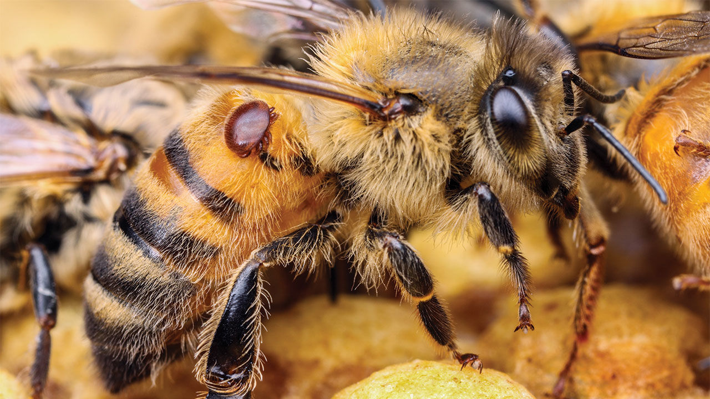

  

## The research paper

This website provides easy access to commented R scripts that allows reproducing the analysis of the data from our publication. In this work, 3 major soft acaricides including 65% Formic acid, Oxalic acid and Thymol were evaluated for their efficacy against honey bee pest *Varroa destructor* mites. We also evaluated these soft acaricides at three different levels for each. Descriptive and inferential statistics were used to document and model the response of soft acaricides mites mortality, efficacy and honey yield.

## Cite this compendium

> Raza, M. M., Dr. (2021, July 6). Research Compendium: Effectiveness of different soft acaricides against honeybee ectoparasitic mite Varroa destructor. <a href ="https://doi.org/10.17605/OSF.IO/N895P">https://doi.org/10.17605/OSF.IO/N895P</a>